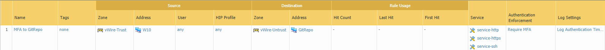
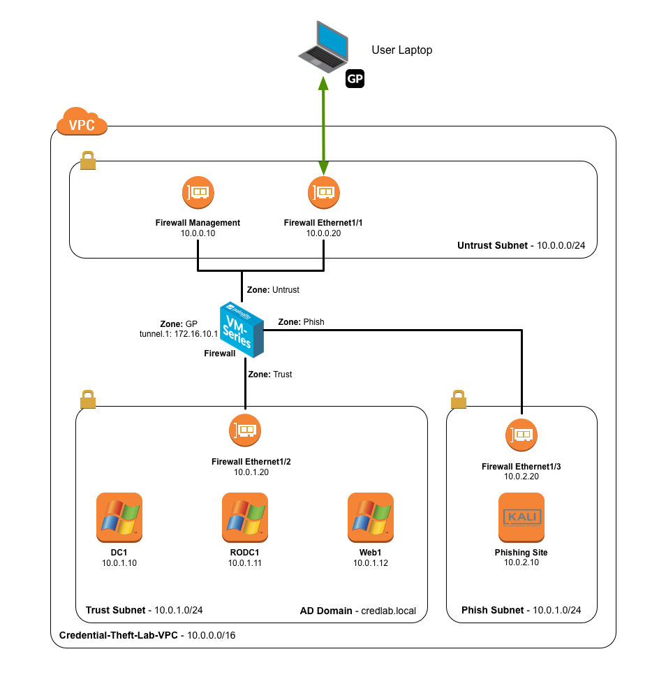

<h1>Credential Theft Lab</h1>

## Background

Phishing attacks to obtain valid corporate credentials are one of the common 
factors in many breaches today.  If the attacker can obtain valid credentials,
they can walk right into the enterprise network bypassing most security solutions and not arouse any suspicions.

In this lab, we will see how we can use Credential Phishing Prevention and Multi-Factor Authentication to prevent 
exposure and abuse of corporate credentials. These new capabilities were added in PAN-OS 8.0.

### Credential Phishing Prevention

Attackers use phishing sites disguised as legitimate ones with the aim to steal user information, especially the user credentials that provide access to corporate networks. When a phishing email enters a network, it takes just a single user to click the link and enter credentials to set a breach in motion. You can now identify and prevent in-progress phishing attacks by controlling sites to which users can submit corporate credentials based on the site’s URL category (as part of URL Filtering, starting from PAN-OS 8.0). This allows you to block users from submitting credentials to untrusted sites while allowing users to continue to submit credentials to corporate and sanctioned sites.
Credential phishing prevention works by scanning username and password submissions to websites and comparing those submissions against valid corporate credentials. You can choose what websites you want to either allow, alert on, or block corporate credential submissions to based on the URL category of the website. Alternatively, you can present a page that warns users against submitting credentials to sites classified in certain URL categories. This gives you the opportunity to educate users against reusing corporate credentials, even on legitimate, non-phishing sites. In the event that corporate credentials are compromised, this feature allows you to identify the user who submitted credentials so that you can remediate.

### Multi-Factor Authentication

To protect services and applications from attackers, you can use the PAN-OS Authentication Policy to control access for end users. Authentication Policy provides the benefit of letting you to choose how many authentication challenges of different types (factors) users must respond to. Using multiple factors of authentication (MFA) is particularly useful for protecting your most sensitive services and applications. For example, you can force users to enter a login password and then enter a verification code that they receive by phone before accessing critical financial documents. To reduce the frequency of MFA challenges that interrupt the user workflow, you can specify an authentication timeout period during which a user responds to the challenges only once for repeated access to services and applications.
The MFA factors that the firewall supports include Push, Short Message Service (SMS), Voice, and One-time password (OTP) authentication. The firewall integrates with MFA vendors through APIs — The supported vendors are currently Duo, Okta, PingID and RSA.

In the example depicted above, when a user on workstation "W10" tries to access the internal corporate Git repository, via either HTTP, HTTPS or SSH, the Next-Generation Firewall will block the traffic until a Multi-Factor authentication is performed by the user. When the request is fulfilled through a browser, the Authentication Policy will redirect the user to a Portal where he or she will provide login and password (First Factor) and, if successful, the Firewall will invoke third party vendors APIs to complete the second (and optionally third, fourth, etc.) factor(s) authentication. If the connection is not browser-based (i.e. a SSH session), it will be blocked by NGFW: the user must login (and perform MFA) to the Authentication Portal first. if the user has the GlobalProtect Client installed on the workstation, a pop-up message will automatically display a notification and provide a link to the Authentication Portal.

## Lab Diagram

You will instantiate an AWS CloudFormation template that builds the below
environment.  It will create the VPC, subnets, security groups, and instances
shown.  You will then connect into the environment using the GlobalProtect client.

## Access Details

You will need this information throughout the lab.

***Table 1* - Lab Instances**

Device	                    | IP	                  | Username      | Password
--------------------------- | ----------------------- | ------------- | ---------
Firewall                    | *Set by CloudFormation* | admin         | *Set by user*  
Domain Controller           | 10.0.1.10               | Administrator | paloalto
Read Only Domain Controller | 10.0.1.11               | Administrator | paloalto
Web Server                  | 10.0.1.12               | Administrator | paloalto
Phishing Site (Kali Linux)  | 10.0.2.10               | kali          | paloalto

***Table 2* - Corporate Active Directory Accounts - Credlab.local**

Username      | Password | Notes
------------- | -------- | -----
Administrator | paloalto | *For lab maintenance only, use user accounts for testing*
user1         | paloalto |
user2         | paloalto |
user3         | paloalto |

## Controlling AWS Costs

In addition to building the lab environment, the CloudFormation template also creates a Lambda
function triggered by a CloudWatch Event Rule to automatically power off the instances at 05:00 GMT
each day.

To change this behavior, change the tag **credential-theft-lab:autopoweroff** to false on the
instances you do not want shut down.
