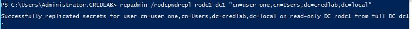

<h1>Credential Phishing Troubleshooting Commands</h1>

If you do not get the URL block page when entering a corporate username/password, troubleshoot using
these commands.

Note that all the screenshots below are from a test environment *that is operating properly.*

On the firewall GUI, under Device > User Identification > User-ID Agents, the agent should be 
connected (green circle).

On the firewall CLI, confirm the username appears in the output of this command: 

`show user ip-user-mapping all`

On the firewall CLI, run this command: 

`show user user-id-agent state all`

At the bottom of the output, examine the highlighted sections below, but mainly confirm that the 
credential enforcement status is "in sync".

On the firewall CLI, confirm that the bloom filter is being sent.

`show user credential-filter statistics`

On the RODC in Windows Powershell, confirm that the password is being replicated to the RODC.

`repadmin /rodcpwdrepl rodc1 dc1 “cn=user one,cn=Users,dc=credlab,dc=local”`

View the last few log lines of each of these log files, and try to determine if there are issues:

`get-content “C:\Program Files\Palo Alto Networks\User-ID Credential Agent\UaCredDebug.log” –tail 15`

`get-content “C:\Program Files (x86)\Palo Alto Networks\User-ID Agent\UaDebug.log” –tail 15`

Here is another firewall command, but it sometimes gives errors when things are working fine:

`tail mp-log useridd.log`

